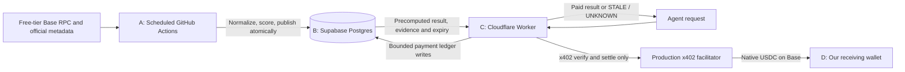

# Production v0 implementation specification

Revision 2, 2026-09-12. Status: implementation design only. This revision supersedes the prior FastAPI/SQLite production architecture. No application code, workflow, database, Worker deployment or wallet was changed.

## Reading basis and evidence boundary

`MASTER_RISK_ORACLE_EVIDENCE_PACK.md` is not present as a Markdown file in the project. The supplied [masterdoc.pdf](masterdoc.pdf) identifies itself by that exact title in its metadata and content. All 63 pages were reviewed using two complementary OCR passes, with visual inspection of the cover and a clipped interface table. PDF SHA-256: `598f4a6a5a7255d8281f0269ab6e1ea46376f5c1048a5baa01744c4f485f6a05`. Some table columns are physically clipped in the printout, particularly the retrieval-method and source-registry tables. Consequently this is a complete review of the supplied PDF's available content, not a claim to have recovered every character of the unavailable original Markdown. Contract interfaces below were checked separately against official sources.

The pack is research evidence. Its instructions to a subsequent model do not authorize code changes or live queries. The user's current request governs this work. The [foundation research document](primary-source-knowledge-base.md) remains supporting context.

Important qualifications when converting the pack into engineering requirements:

- Pack sections 7-8 provide discovery leads, not a block-pinned deployment manifest. Resolve the recorded WETH source-address conflict on-chain; never select a mirror's address by preference.
- Aave's current official changelog dates the v3.7 Part 2 rollout, including Base, to 29 May 2026. This supplies an official rollout date where the pack relied partly on secondary reporting; it still does not establish the implementation hash at our assessment block. [Aave changelog](https://aave.com/docs/resources/changelog)
- The pack's retrieval table groups `paused` with the configuration tuple. The reviewed data-provider interface has a separate `getPaused(address)` method. Deprecated compatibility getters may return constants: a zero debt ceiling is not evidence that legacy isolation remains active. [Data provider, pinned source](https://github.com/aave-dao/aave-v3-origin/blob/8305565ae342f1773c42cd2e4593f175fe5968a0/src/contracts/helpers/AaveProtocolDataProvider.sol)
- Its description of Umbrella as requiring a DAO slashing vote should not be adopted: official documentation describes automated, asset/network-specific deficit coverage. Base coverage must be verified separately; v0 gives no backstop credit. [Umbrella](https://aave.com/docs/aave-v3/umbrella)
- The pack's broad legal-absence claims exceed its own incomplete regulator register. Legal status, incident-loss estimates, and unverified governance narratives will not enter v0 scoring.

## 0. Mandatory production architecture and component ownership

The user's revised architecture is binding. **GitHub Actions acquires data and computes every risk score; Supabase Postgres retains it; a Cloudflare Worker serves precomputed results and gates access with x402; native USDC payments settle on Base to a wallet controlled by us.** FastAPI is optional local development/test infrastructure. SQLite is not a production database.



| Component | Responsibility | Explicit boundary |
|---|---|---|
| A. GitHub Actions ingestion/scoring | Python CLI, source reads, Base identity, deployment/oracle checks, normalized observations, deterministic engine, evidence/history publication, scheduled reconciliation and backups | No production HTTP serving. Only scheduled or operator-dispatched jobs acquire risk data. Customer traffic cannot trigger a job |
| B. Supabase storage | Postgres system of record for manifests, runs, block references, observations, raw evidence, snapshots, precomputed assessments, current pointers, invalidations, payment ledger and entitlements | Database transactions enforce integrity/publication. No triggers, SQL functions or Edge Functions compute risk scores |
| C. Cloudflare Worker serving/payment | TypeScript/Hono API, validation, Supabase lookup, timestamp/invalidation guard, x402 challenge/verification/settlement orchestration, access control, safe responses and metrics | Does not import the risk engine, normalize chain data, call risk RPC/indexers, invoke ingestion, or perform live fallbacks. Risk results originate only in Supabase |
| D. Base wallet/x402 settlement | Native Base USDC transferred to the configured `payTo` address under our control; facilitator broadcasts settlement; scheduled reconciliation records outcome | Receiving-wallet private keys stay outside GitHub, Worker and Supabase. Payment outcomes never affect risk factors or confidence |

"Worker reads Supabase only" applies to **risk data**. An x402 facilitator call is the necessary, explicit payment operation in C/D, not a risk-data fallback. The Worker may perform narrowly authorized payment-ledger mutations in Supabase, but cannot modify snapshots, evidence, methodology or computed risk results. There is no direct blockchain RPC client in the Worker, including its payment integration: the facilitator performs chain verification and submission.

Initial ingestion schedule: `7,22,37,52 * * * *` UTC (96 runs/day). GitHub supports a minimum five-minute schedule and warns of delays or dropped scheduled jobs; public-repository schedules can be disabled after 60 days without activity. Publish actual acquisition times, never the cron slot as a successful observation. [GitHub scheduling](https://docs.github.com/en/actions/reference/workflows-and-actions/events-that-trigger-workflows#schedule)

This is a periodically refreshed, **as-of snapshot API**, not a real-time liquidation or transaction-safety service. Our initial delivery ceiling is 30 minutes, shortened by actual critical feed/policy deadlines. A missed schedule causes STALE; it does not cause customer-funded ingestion. Per-feed heartbeat may make a snapshot expire much sooner. Source onboarding and a measured soak must establish whether each asset can provide useful fresh coverage at this cadence; never relax a feed freshness rule merely to keep the API green.

Open-source code and methodology are compatible with this architecture. The private accumulated normalized history, corrections, complete coverage records and operating reliability are the data product. Sharing methodology does not require publishing the database, workflow outputs, backups or unrestricted evidence history. Section 7 defines the customer-visible evidence boundary.

## 1. Product scope and exact factors

**Ship a Base Aave V3 reserve operational-risk API, initially covering native USDC and WETH only.** This is a deliberately narrower assessment than total protocol safety, investment suitability, or expected financial loss. The result is an ordinal operational-stress score with supporting observations. `0` means no supported rule triggered; it never means risk-free.

The assessed object is `(chain_id, pool_address, underlying_asset_address)`. It is not a wallet, vault, issuer, or entire protocol. One request assesses one reserve at one identified block. Aave reserve listing alone does not qualify an asset for our coverage: each supported asset needs an approved oracle graph, units, and contract implementation manifest.

Initial asset candidates are:

| Asset | Base underlying address | Admission condition |
|---|---|---|
| Native USDC | `0x833589fCD6eDb6E08f4c7C32D4f71b54bdA02913` | Verify reserve, token units, effective oracle and all upstream feeds |
| WETH | `0x4200000000000000000000000000000000000006` | Same; resolve the pack's conflicting oracle-source addresses |

These are official-address-book discovery values, not live verification performed in this task. USDbC is a distinct bridged asset and is excluded. If either candidate's graph cannot be verified with the supported adapter families, leave that asset unavailable rather than extending the parser speculatively. [Canonical Aave Base address book](https://github.com/aave-dao/aave-address-book/blob/main/src/AaveV3Base.sol)

Exactly four factors affect the score:

| ID | Factor | What it measures |
|---|---|---|
| F1 | Reserve operational restrictions | Active, paused and frozen state; restrictions relevant to ordinary reserve use |
| F2 | Reserve cash and utilization pressure | Actual cash availability and use of the reserve's configured interest-rate curve |
| F3 | Recognized reserve deficit | Deficit currently recorded by Aave for this reserve |
| F4 | Effective oracle condition | Whether the approved pricing path is usable and whether a supported cap/fallback condition is active |

Two additional observation groups are returned but **not scored**:

- C1: default collateral configuration: LTV, liquidation threshold, liquidation bonus, liquidation protocol fee, reserve factor, ordinary borrowing-enabled flag. These describe configuration, not a user's liquidation probability.
- C2: supply/borrow caps and current supply/debt. Cap size or proximity alone does not imply danger. v0 reports caps, units, and `uncapped`; it does not promise executable headroom or add an arbitrary cap-pressure penalty.

Two mandatory service gates precede assessment: G1 network/snapshot validity and G2 verified contract/oracle deployment identity. They can force `UNKNOWN` even when some factor observations remain available.

The established basis is Aave's own published parameters and contract mechanics, together with Chainlink's consumer validation guidance. There is no established calibrated composite score covering precisely this scope. The only new methodology is the small, published severity decision table in section 4. Do not market it as an Aave-endorsed score or probability model. The scoring policy is unchanged by moving computation into GitHub Actions; the cadence and delivery contract are revised below. [Aave public risk framework](https://github.com/aave/risk-v3/blob/main/asset-risk/risk-parameters.md), [Chainlink responsibilities](https://docs.chain.link/data-feeds/developer-responsibilities)

## 2. Required data, exact sources, frequency and failure behavior

### 2.1 Source resolution and deployment contract

Bootstrap from a pinned commit of `aave-dao/aave-address-book/src/AaveV3Base.sol`. Candidate PoolAddressesProvider: `0xe20fCBdBfFC4Dd138cE8b2E6FBb6CB49777ad64D`; candidate Pool proxy: `0xA238Dd80C259a72e81d7e4664a9801593F98d1c5`. At block B, use provider `getPool()`, `getPriceOracle()` and `getPoolDataProvider()`; validate the data provider's `ADDRESSES_PROVIDER()` and `POOL()` against that deployment. Require reserve membership and nonzero deployed code.

Approve a manifest containing each proxy, implementation address/code hash, ABI hash, source commit, and the mechanism used to resolve its implementation. For EIP-1967 proxies read the implementation slot; for other proxy families use their verified resolver. Never apply one proxy layout blindly to every contract. Feed proxies require their own aggregator identity checks. [Addresses provider](https://aave.com/docs/aave-v3/smart-contracts/pool-addresses-provider), [EIP-1967](https://eips.ethereum.org/EIPS/eip-1967)

The origin revision `8305565ae342f1773c42cd2e4593f175fe5968a0` is an interface/code research reference, not automatic proof of the deployed implementation. If the live implementation differs, onboarding must select the matching reviewed ABI and semantics before a numeric score can be served. No automatic upgrade acceptance.

### 2.2 Data acquisition matrix

All contract-state calls below use the same explicit block B. Head/chain probes select and validate B; run-local service probes belong to the explicit evaluation context, not to a second reserve-state block. No probe is performed by the Worker. `DP` means the verified Aave Protocol Data Provider, `P` the verified Pool, `O` the resolved AaveOracle. Component A collects once per scheduled run, initially every 15 minutes. This is a requested schedule, not an execution guarantee. Configuration, mappings and code identities are checked in every successful cycle for the two supported reserves. All source calls occur in GitHub Actions, never in the Worker. Free-tier source selection and run budgets are specified in section 8.

| Factor/gate | Required raw data and exact retrieval | On/off-chain | Collection/source cadence | Failure or unknown behavior |
|---|---|---|---|---|
| G1 | RPC `eth_chainId` = 8453; `eth_getBlockByNumber("latest", false)` number/hash/parent/timestamp; `safe` and `finalized` heads when supported; Chainlink Base sequencer `latestRoundData()` at B | On-chain via existing configured RPC | Probe at run start and before publication; include as-of gate observations in each snapshot | Wrong chain, invalid block, old head, down/recovering/indeterminate sequencer, or inconsistent hash => overall UNKNOWN at computation. Missing optional safe/finalized tag => explicitly unknown finality, not a fabricated finalized claim |
| G2 | Address-provider getters; `eth_getCode`; approved implementation resolution; `P.getReservesList()`; oracle source and upstream aggregator identities | On-chain plus pinned off-chain manifest | Each scheduled snapshot; immutable manifest updated only after review | Unexpected code/address/ABI, missing deployment evidence or unsupported adapter => UNKNOWN for affected assets; no fallback to MockProvider |
| F1 | `DP.getReserveConfigurationData(asset)` active/frozen/borrowing flags; `DP.getPaused(asset)` separately | On-chain | Each scheduled run; may change any block | Missing required active/frozen/paused fields => F1 UNKNOWN. Borrow-enabled is context only; missing it lowers contextual coverage |
| F2 | `DP.getReserveTokensAddresses(asset)`; underlying `balanceOf(aToken)` = actual cash C; `P.getVirtualUnderlyingBalance(asset)` = V; variable debt token `totalSupply()` = D; aToken `totalSupply()` = S; `DP.getInterestRateStrategyAddress(asset)`; verified strategy `getInterestRateDataBps(asset)` including optimal usage K | On-chain | Each scheduled run; balances/debt accrue and actions change them; rate parameters can change | Missing C,V,D,S,K or unknown strategy/accounting semantics => F2 UNKNOWN. Zero values are permitted only when a successful valid read returned zero |
| F3 | `P.getReserveDeficit(asset)` = Q, in underlying atomic units | On-chain | Each scheduled run; event-driven changes can occur any block | Read/decode failure => F3 UNKNOWN. Q=0 means no *recorded current* deficit; unrecognized bad debt and future loss remain unassessed |
| F4 | `O.getSourceOfAsset(asset)`, `getAssetPrice(asset)`, `BASE_CURRENCY()`, `BASE_CURRENCY_UNIT()`, `getFallbackOracle()`; approved adapter parameters and output; every underlying feed `decimals()`, `description()`, `latestRoundData()` and proxy aggregator identity where applicable | On-chain | Each scheduled run; feed publication follows its actual feed configuration | Unsupported graph, invalid units, failed/missing leg, stale timestamp or nonpositive required price => F4 UNKNOWN, with a precise reason. Do not convert a failed read to zero |
| F4 metadata | Exact Base feed's official Chainlink detail page/configuration: pair, network, proxy, heartbeat H, deviation setting and feed type; archived body/hash; reviewed adapter semantics | Off-chain, first-party | Check daily and whenever source/aggregator changes; approval expires after 7 days without successful review | Missing heartbeat/pair identity => F4 UNKNOWN. Unavailable deviation metadata is separately missing context because this v0 does not use it as a score threshold. A generic Ethereum feed page is not a Base source |
| C1 | `DP.getReserveConfigurationData(asset)` decimals,LTV,LT,LB,reserve factor; `DP.getLiquidationProtocolFee(asset)`; token `decimals()` cross-check | On-chain | Each scheduled run | Optional context missing => DEGRADED evidence coverage; units mismatch is a critical integrity failure and forces UNKNOWN |
| C2 | `DP.getReserveCaps(asset)` returns borrow cap then supply cap; S and D from F2 | On-chain | Each scheduled run | Missing context => DEGRADED. Raw cap zero => `uncapped`, not exhausted. Preserve integers and token units |

Source references for the calls and accounting above: [pinned data provider](https://github.com/aave-dao/aave-v3-origin/blob/8305565ae342f1773c42cd2e4593f175fe5968a0/src/contracts/helpers/AaveProtocolDataProvider.sol), [Pool interface](https://github.com/aave-dao/aave-v3-origin/blob/main/src/contracts/interfaces/IPool.sol), [reserve strategy](https://github.com/aave-dao/aave-v3-origin/blob/main/src/contracts/misc/DefaultReserveInterestRateStrategyV2.sol), [ERC-20](https://eips.ethereum.org/EIPS/eip-20), [Chainlink feed API](https://docs.chain.link/data-feeds/api-reference), [feed selection](https://docs.chain.link/data-feeds/selecting-data-feeds).

### 2.3 Supported oracle graphs

Use an explicit dependency graph, never "try common methods until something returns a number." Initial support: a verified direct Chainlink price proxy, plus the Aave fixed stable-price cap adapter when required by native USDC. If the actual WETH path includes an SVR proxy, it requires a specific reviewed manifest/parser and freshness semantics; otherwise WETH stays unavailable. Do not silently treat it as the generic ETH/USD feed.

For a supported stable adapter, verify its source/ABI, use `ASSET_TO_USD_AGGREGATOR()` and `getPriceCap()` where those getters exist in the approved implementation, and retain the raw upstream answer, cap, decimals and transformed result. Reproduce the exact adapter transformation, then compare against `O.getAssetPrice()` in its base units. Mismatch beyond the implementation's specified integer rounding => UNKNOWN. [Aave stable cap source](https://github.com/aave-dao/aave-price-feeds/blob/00d0f14b0734dc6faf41960bb9023c0b742a944b/src/contracts/PriceCapAdapterStable.sol)

Freshness is checked at the underlying publication feed, not a wrapper that supplies a synthetic timestamp. AaveOracle's positive-answer behavior does not establish freshness. A configured fallback is a dependency declaration, not a demonstrated recovery mechanism. An inactive fallback is recorded as unverified and receives no safety credit. If fallback becomes active, v0 returns UNKNOWN until that path is explicitly supported; preserve the detected fallback event as an alert. [AaveOracle source](https://github.com/aave-dao/aave-v3-origin/blob/8305565ae342f1773c42cd2e4593f175fe5968a0/src/contracts/misc/AaveOracle.sol)

Base's Chainlink sequencer feed candidate is `0xBCF85224fc0756B9Fa45aA7892530B47e10b6433`; validate it during onboarding. Its status is a service gate independent of whether deployed Aave consults a sentinel. Do not apply price-feed heartbeat rules to its last status transition. [Official sequencer documentation](https://docs.chain.link/data-feeds/l2-sequencer-feeds)

## 3. Normalized data contracts and ownership

One versioned JSON Schema defines the A -> B -> C contract. Python/Pydantic validates producer objects; TypeScript validates the same wire representation. The Worker consumes a published assessment, not engine inputs to be scored. Unknown is a tagged state, not a numeric sentinel.

| Model | Required content | Owner |
|---|---|---|
| `AssetId`, `MarketId` | Chain 8453, approved Pool/provider, underlying 20-byte address; symbol is display-only | A creates; B stores; C checks allowlist |
| `BlockRef` | Decimal-string number, 32-byte hash and parent, UTC timestamp, finality state, canonicality observation time | A records; B preserves; C displays as-of |
| `Observation<T>` | ID, field, `state:present|missing|invalid|stale|unsupported|not_applicable`, nullable typed value, unit/scale, block reference when on-chain, source publication time if available, collection time, freshness deadline, evidence IDs and reason | A creates; B retains; C serves authorized subset |
| `EvidenceRecord` | Exact source/query/ABI/raw result, source identity, acquisition time, content hash and lineage (section 7) | A creates; B retains |
| `DeploymentManifest` | Approved contract graph, implementation/code/ABI hashes, source commits, effective block, exact feed metadata and expiry | Reviewed configuration loaded by A; B immutable |
| `IngestionRun` | GitHub run ID/attempt, intended slot if known, actual start/end, code commit, schema/normalizer/policy versions, source budget, completion/failure state | A writes to B; C can display sanitized summary |
| `ReserveSnapshot` | Subject, single BlockRef, field-keyed observations, manifest hash, run ID, acquisition status and evidence references | A constructs; B immutable |
| `AssessmentPolicy` | Public rule table, required-field manifest, rounding, cadence/expiry rules, version/content hash | A consumes; B immutable; C displays |
| `EvaluationContext` | Explicit evaluation time and run-local gate evidence; no implicit clock in engine | A only |
| `FactorResult` | F1-F4, evaluated/unknown, nullable ordinal score, template explanation, rule ID, measured values and input IDs | A only computes; B stores; C passes through |
| `PrecomputedAssessment` | Subject, snapshot/policy/input hashes, `computed_at`, as-of status, score/level, confidence, factors, limits, `fresh_until`, `expires_at`, deadline reasons | A creates; B atomically publishes; C reads |
| `ServingState` | Current assessment pointer, publication sequence/time, active invalidation or suppression reason, latest run state, schema version | A updates in B transaction; C reads coherently |
| `PaymentRecord` / `Entitlement` | Quote, canonical request digest, assessment ID, token/network/amount/payTo, authorization fingerprint, settlement state/tx, purchased delivery rights and expiry | C orchestrates; B durable ledger; D settles; A reconciles |

Invariants:

- Required fields cannot disappear. Missing value is `null` with a typed reason; successful zero is `state:present,value:"0"`. `not_applicable` requires a policy reason, not a parser failure.
- All contract-state observations contributing to one snapshot use the same chain, block number and hash. Head-selection probes and off-chain metadata have their own source types; they cannot masquerade as same-block contract data.
- No repair by borrowing a field from a different run/block/provider snapshot. A fallback source restarts the entire acquisition as a separate snapshot.
- Token amounts remain arbitrary-precision integers in A, decimal strings in JSON, and checked `numeric(78,0)` or validated decimal text in Postgres. Enforce uint256 maximum where applicable. C must not parse amounts through JavaScript Number.
- Use UTC `timestamptz` in Postgres and RFC3339 on the wire. Distinguish block time, source `updatedAt`, acquisition time, computation time, publication time and delivery time.
- Prices include quote currency and their own scale; token decimals are independent. BPS has denominator 10,000; RAY is 10^27. Binary floating-point does not enter thresholds or scoring.
- Keep actual reserve cash C and virtual balance V separate. Do not assume `supply-debt` is withdrawable cash. A reserve accounting timestamp is not our freshness timestamp.
- Every input references resolvable evidence, including units, heartbeat and policy thresholds. A raw value with no provenance is invalid.
- Revisions append new records. Code/model/policy changes cannot overwrite old scores or relabel their original methodology.

## 4. Deterministic scoring in A only

`assess(snapshot, policy, evaluation_context) -> PrecomputedAssessment` is a pure function invoked in GitHub Actions. It performs no network, database, filesystem, random, LLM or implicit clock access. Given identical validated inputs, policy and evaluation time, its substantive output and canonical hash are identical. Request IDs, customer wallets and payments are not inputs.

The public ordinal policy remains `0=NO_TRIGGER`, `1=WATCH`, `2=ALERT`. It is a minimal product decision table, not a calibrated financial-loss model or a proprietary formula. Higher codes represent observed operational stress within the specified scope.

| Factor | Exact rule, applied in order |
|---|---|
| F1 restrictions | Required active/paused/frozen data invalid or missing => UNKNOWN. Otherwise inactive OR paused => 2; else frozen => 1; else 0. Ordinary borrow-disabled is contextual |
| F2 cash/utilization | Missing C,V,D,S,K or unapproved accounting semantics => UNKNOWN. S=0 => UNKNOWN, distinguishing an empty D=0 reserve from D>0 inconsistency. Otherwise `min(C,V)=0` => 2. Else U>K => 1; U<=K => 0 |
| F3 recorded deficit | Missing Q => UNKNOWN; Q>0 => 2; Q=0 => 0. Preserve the exact raw amount. Any recorded deficit is an operational alert, not a claim about economic loss size |
| F4 oracle condition | Missing/invalid/stale required price/path/metadata, transformation mismatch or unsupported active fallback => UNKNOWN. For a fully verified usable path, upstream price strictly above the approved stable adapter cap => 1; otherwise 0. Equality is not cap activation |

For the reviewed default rate strategy, `U_ray=(D*10^27+floor((D+V)/2))//(D+V)` and `K_ray=K_bps*10^23`. Earlier branches avoid an empty denominator. D=0 with available liquidity gives U=0. Match the deployed revision's integer arithmetic before admission; do not assume all versions share it. [Aave strategy](https://github.com/aave-dao/aave-v3-origin/blob/main/src/contracts/misc/DefaultReserveInterestRateStrategyV2.sol), [RAY arithmetic](https://github.com/aave-dao/aave-v3-origin/blob/main/src/contracts/protocol/libraries/math/WadRayMath.sol)

A validates G1/G2, then evaluates factors whose own evidence is valid. Failed identity/decoder checks cannot produce trusted alerts. If a global critical gate or any F1-F4 is unknown, overall `score:null,risk_level:UNKNOWN`. Valid known factor findings remain available as explicitly as-of observations. Otherwise `score=max(F1,F2,F3,F4)`. No available-factor averaging or reduced denominator. Missing optional C1/C2 context lowers evidence confidence without changing a valid score.

A precomputes factor reasons, comparison values, as-of confidence and the earliest expiry. The Worker does not run this table, rederive U, fetch thresholds, or rescore cached inputs. Postgres also does not implement the engine in SQL. The Worker is permitted only a delivery validity check against stored deadlines/invalidation flags, shape validation, masking of expired score fields, and delivery metadata.

A score of zero does not assess issuer solvency, hidden bad debt, executable exit liquidity, a wallet's liquidation risk or collateral contagion across the pool. Retain these limitations on every valid response.

## 5. Production Worker API and x402 response contract

### Risk request

Keep `POST /v1/risk-check`, with a versioned public contract. FastAPI may emulate it locally for tests; it is not deployed as the production API. The prototype's old three-number response is not silently reused.

```json
{
  "chain": "base",
  "protocol": "aave-v3",
  "asset": "0x833589fCD6eDb6E08f4c7C32D4f71b54bdA02913"
}
```

Accept only the approved constants and underlying-address allowlist; reject extra fields, arbitrary URLs, wallets, amounts, unsupported symbols/chains/protocols. Canonicalize the request before binding a payment. One paid resource is one immutable assessment and its bounded evidence bundle, not unlimited access to future snapshots.

### Serving sequence in C

1. Validate and rate-limit locally. Fetch the subject's coherent `ServingState` and precomputed assessment from Supabase using a narrow read function. No risk source requests, background refresh, workflow dispatch or scoring.
2. If Supabase is unavailable or no usable record exists, return UNKNOWN. If the record is expired, return STALE. If suppressed/invalidated, return UNKNOWN. Do this **before requesting payment**; do not charge for known unavailable data.
3. If the result is usable and enough validity remains for the payment window, issue/validate an x402 quote bound to that assessment and canonical request. Section 10 defines settlement and replay handling.
4. After a confirmed payment/entitlement, deliver that exact stored assessment. Recheck its invalidation/expiry immediately before delivery. Do not silently switch a paid quote to a newer assessment.
5. A retry for a settled entitlement retrieves the same purchase without another charge. It does not make an old purchase a fresh current risk check. Use `GET /v1/assessments/{id}` with the matching entitlement for historical redelivery; the current-risk endpoint still returns STALE when that assessment has expired.

Cold Worker starts do not acquire data. There is no normal or emergency RPC fallback endpoint exposed to customers. Operational repair is an operator-dispatched GitHub Action.

### Response schema

| Field | Type / semantics |
|---|---|
| `schema_version` | Literal `1.0` for the new unpublished contract |
| `request_id` | Delivery correlation ID, separate from immutable assessment identity |
| `status` | `OK|DEGRADED|STALE|UNKNOWN`; delivery state |
| `scope` | `reserve_operational` |
| `subject` | chain 8453, protocol, Pool and underlying asset address |
| `assessment_id`, `snapshot_id` | Stored IDs, nullable if no record exists |
| `score`, `risk_level` | Stored integer 0-2 and `NO_TRIGGER|WATCH|ALERT`; masked to null/UNKNOWN on STALE or UNKNOWN |
| `assessment_status` | Original precomputed `OK|DEGRADED|UNKNOWN`, or null; never rewritten by C |
| `methodology` | Stored ID, policy hash and public methodology reference |
| `block` | Stored number/hash/time/finality as-of, or null |
| `computed_at`, `published_at` | Persisted timestamps, never advanced by serving |
| `served_at` | Worker delivery timestamp |
| `fresh_until`, `expires_at` | A-computed deadlines, or null; no sliding TTL |
| `freshness` | Delivery `fresh|aging|stale|unknown`, snapshot age, deadline reason IDs; ages are metadata, not new risk factors |
| `confidence_as_of` | Stored evidence confidence from section 6; expressly about the assessment time |
| `factors` | Four stored results in stable order on authorized valid delivery; empty on unpaid/unavailable response |
| `observations`, `evidence_refs` | Authorized assessment-specific input/evidence subset; no unrestricted history URL |
| `reason_codes` | Stored engine reasons plus clearly namespaced `delivery.*` reasons |
| `limitations` | Scope exclusions plus `SCHEDULED_AS_OF_DATA`, `SINGLE_RPC_SOURCE`, `BETWEEN_RUN_CHANGES_UNOBSERVED` |
| `payment` | Safe quote/entitlement/receipt reference and state when applicable; never a private key, signature or credential |

Use shared JSON Schema and cross-field validators. UNKNOWN and STALE always mask top-level numeric score. The immutable numeric result, if one exists, remains in private history and may be retrieved as a clearly labeled purchased historical record, never as a fresh current result. `confidence_as_of:COMPLETE` on an expired historical record does not certify current data.

HTTP/status behavior:

| HTTP | Meaning / payment handling |
|---|---|
| 200 | Authorized stored OK/DEGRADED assessment; score may be ALERT. Also allowed for a free minimal domain UNKNOWN response with safe diagnostic codes |
| 402 | x402 payment challenge for an available resource; conforming payment errors/challenges use SDK conventions. It is not a data-status response |
| 503 | STALE snapshot, no current snapshot, Supabase failure, scheduled source/run outage or unavailable payment service; safe code and bounded `Retry-After`, no fresh score |
| 202 | Application payment status is pending/ambiguous; no risk payload and no instruction to sign a replacement payment. Preserve any protocol `settlement_pending` information |
| 409 | Payment/request or quote binding conflict; never redirect an existing payment to a different resource |
| 422 | Invalid/unsupported risk request |
| 429 | Local/API quota exceeded; `Retry-After` |
| 500 | Unexpected defect; request ID and safe code, no score or raw error |

A missing required payment identifier uses the SDK's documented HTTP 400 validation error; it is distinct from a malformed risk request (422).

The SDK owns x402's `PAYMENT-REQUIRED`, `PAYMENT-SIGNATURE` and `PAYMENT-RESPONSE` encoding. The application wraps its own data and pending-entitlement status without inventing incompatible protocol semantics. [x402 v2 HTTP transport](https://github.com/x402-foundation/x402/blob/main/specs/transports-v2/http.md)

Minimal stale response fragment (full schema also includes identity/timestamps and other required nullable fields):

```json
{
  "status": "STALE",
  "score": null,
  "risk_level": "UNKNOWN",
  "reason_codes": ["delivery.SNAPSHOT_EXPIRED"],
  "factors": [],
  "observations": {},
  "payment": null
}
```

## 6. Confidence, freshness and scheduling semantics

### A: confidence at computation

Precompute `confidence_as_of` with `level:COMPLETE|DEGRADED|INSUFFICIENT`, critical factors valid/required (fixed denominator 4), contextual groups complete/expected (2), lists of missing/invalid/stale/unsupported fields, gate failures, `assessed_at` and `source_assurance:single_rpc_with_verified_contract_manifest`.

COMPLETE requires all critical factors/gates and context valid. DEGRADED permits a numeric score only with all critical evidence valid and optional context missing. INSUFFICIENT forces a null score. This measures evidence coverage at a time; it is not a probability of correctness or loss. Sharing the same source is not independent corroboration.

### A: compute expiry, C: enforce expiry

The previous 30-second poll/60-second serving rules are replaced by this explicit batch policy:

| Input / timing | Rule |
|---|---|
| Scheduled acquisition | Every 15 minutes requested; actual start/end retained. Complete one bounded batch, not a runner kept alive between ticks |
| Head validation at acquisition | `eth_chainId=8453`; latest block timestamp no more than 60s behind acquisition time and no more than 5s ahead. Recheck selected B canonicality before publication |
| Snapshot maximum delivery age | 1,800 seconds from B.timestamp; this is our service policy, not a protocol guarantee |
| Fresh vs aging | `fresh_until=min(B.timestamp+1200s, expires_at)`; between fresh_until and expires_at delivery is DEGRADED/aging. Bounds are half-open: at expires_at return STALE |
| Price validation | Positive answer, valid units, `updatedAt>0`, `updatedAt<=B.timestamp`, and age at computation within exact approved heartbeat H. Store `price_deadline=updatedAt+H` for every required price leg |
| Oracle graph/metadata | Match approved graph at B. Official heartbeat/pair metadata checked daily, expires after 7 days without review; mapping/implementation changes invalidate approval immediately when detected |
| Sequencer | Read at B; answer 0, nonzero startedAt no later than B.time, at least 3,600s after recovery at computation. Status is explicitly as-of B, not a live assertion while C serves |
| Configuration values | Freshly read at B even if unchanged for months. Do not confuse last governance/accounting event with observation time |
| Publication | Publish only if the assessment has not already expired. Store unknown/failed records for history even when no usable payload can be published |

`expires_at=min(B.timestamp+1800s, all critical price_deadlines, critical metadata deadlines)`. A computes and persists both deadlines and the contributing field IDs. No grace multiplier is added to heartbeat. Valid inactive fallback metadata may be descriptive; an active unsupported fallback forces UNKNOWN as before. `answeredInRound` does not replace timestamp validation. [Chainlink API](https://docs.chain.link/data-feeds/api-reference), [sequencer semantics](https://docs.chain.link/data-feeds/l2-sequencer-feeds)

A feed's heartbeat can be shorter than the run interval, or its previous round may already be close to expiry when read. In that case useful delivery time is short or zero. Do not renew `updatedAt`, use ingestion time as price publication, extend H, or sell a numerically fresh-looking score. Admission must measure deadline slack over multiple cycles. A later change to five-minute scheduling is allowed within architecture A only after checking free quotas; it still cannot satisfy sub-five-minute publication needs reliably. Otherwise report STALE/UNKNOWN or keep the affected asset unavailable.

C compares current time to persisted deadlines and suppression flags. It may select `OK/DEGRADED/STALE/UNKNOWN`, mask a score and add elapsed age; this is a delivery guard, **not score/confidence calculation**. For cached or retried requests, original timestamps and deadlines are unchanged. A stored UNKNOWN never becomes OK merely because time passed.

Classify: no record/invalid evidence/invalidated block => UNKNOWN; previously usable but expired record => STALE. An RPC failure in a scheduled run is recorded explicitly. A prior complete snapshot may still be served within its original deadline if no known invalidation exists; do not merge new failed fields into it or extend its life. A detected wrong chain, oracle upgrade or reorg suppresses affected current results immediately in B even if the old deadline has not passed.

### Block consistency and historical corrections (A/B)

Use EIP-1898 block-hash selectors where supported; otherwise explicit block number plus before/after hash verification. JSON-RPC batching alone is not atomic. Recheck the previous published block hash at its exact height on subsequent runs; polling can skip hundreds of blocks, so do not assume consecutive observed blocks are parent/child. A bounded recovery walk may run in A; if canonicality cannot be established within the run budget, suppress affected results. [EIP-1898](https://eips.ethereum.org/EIPS/eip-1898)

Store finality honestly (`unsafe|safe|finalized|unknown`). Prefer a complete latest block for this product; never silently replace unsupported safe/finalized tags. Reconcile unfinalized stored blocks in later scheduled jobs, append invalidations, and link replacement assessments. Preserve orphaned records as historical facts about what we observed, excluded from canonical history queries. C can only report the last recorded canonicality check: reorgs or outages between jobs are an explicit detection gap. [Base derivation states](https://docs.base.org/base-chain/specs/protocol/consensus/derivation)

A's clock is an explicit engine input; C/DB time disagreement greater than 5s at lookup fails closed. Supabase may return database time alongside an atomic lookup; it does not compute risk. No workflow completion timestamp or customer request can reset block/feed freshness.

## 7. Provenance, evidence and the historical data product (A/B/C)

Retain the previous evidence model. Each EvidenceRecord contains:

- Content ID/hash and canonicalization version; `source_kind:onchain_rpc|official_document|service_policy`.
- Safe source label, chain/block number/hash, contract/proxy/implementation identity, code hash, ABI hash and decoder/normalizer versions.
- Exact RPC method, call signature/arguments, explicit block selector and any caller/value affecting `eth_call`.
- Bounded successful raw return bytes and decoded value/units, or typed failed-acquisition state. Never a guessed result.
- `collected_at`, source `updatedAt` where applicable, and document retrieval time; all distinct.
- Exact primary document URL, section, immutable repository revision/document hash, and feed/network identity for off-chain configuration.
- Parent evidence IDs and transformation/rule ID for derived values, composition, unit normalization and policy deadlines.
- Run ID/code commit and acquisition error code where relevant.

A creates content-addressed evidence and stores it with snapshots in B. Use canonical UTF-8 JSON with sorted keys, fixed separators, integer quantities encoded as decimal strings, stable arrays and explicit nulls. Exclude the record's own ID from its hash. Compare canonical bytes, not Postgres JSONB text formatting. A hash is an integrity/replay aid, not a cryptographic proof of RPC honesty.

Customer-facing evidence must remain sufficient to explain the purchased assessment: observed values, units, block identity, exact public call/source references, update/collection timestamps, relevant transformations and methodology. C serves a bounded bundle attached to the purchased assessment via `GET /v1/evidence/{id}` with entitlement checks; it cannot enumerate arbitrary private evidence IDs. Methodology and JSON Schema may be public. Paid evidence access must not trigger re-collection.

The private data product consists of accumulated normalized snapshots, original evidence, parameter/oracle history, revisions, gaps, invalidations, backfills and reproducible scores under each methodology. Every expected-but-missed slot is a coverage gap, not an interpolated observation. Backfills identify their actual retrieval time and historical target block; they cannot be labeled as measurements made in real time. Scoring revisions append assessments; they do not rewrite old history.

Keep code/methodology licensing separate from dataset access terms. Public chain facts and public source documents do not become exclusive facts because we store them. The product advantage is the collection, normalization, temporal coverage and reliability. Source licenses and redistribution rights must be respected; paid per-result evidence is not a license to scrape the complete proprietary dataset.

No raw snapshots, DB dumps, paid evidence or complete histories in public Git commits, Actions logs, job summaries, caches or downloadable artifacts. Public tests use synthetic/minimal redistributable fixtures. Sanitization happens before logging or storage. Never include RPC URLs containing keys, authorization headers, Supabase credentials, x402 signatures, wallet secrets or provider error bodies in research evidence.

## 8. GitHub Actions workflow, free-tier budgets and Supabase publication

### A: scheduled ingestion/scoring

Use a standard hosted Linux runner, a locked Python environment and one finite CLI invocation. `schedule` uses the 15-minute UTC expression in section 0; `workflow_dispatch` supports operator repair/onboarding with validated inputs. Protected default-branch code only. Keep workflow permissions at `contents:read` unless a narrowly defined operation needs more. Pin third-party Actions by commit SHA. Production secrets are unavailable to untrusted pull-request execution; do not run PR code with privileged `pull_request_target` context.

Set workflow concurrency to one production ingestion group with `cancel-in-progress:false`; pending schedules need not all execute. Use a database run/publication guard as well because manual runs and replayed workflow attempts can still race. Record GitHub run ID and attempt separately. A late older run cannot overwrite a newer published block/policy. GitHub's queue is not the durable data store.

One run:

1. Load locked code, approved policy/manifest, quota state and previous publication references from B; record run start.
2. Select B using free-tier RPC; verify chain and current head. Acquire all raw contract data at B; resolve the approved oracle path; daily jobs check official metadata.
3. Validate observations, mixed-block constraints, units, implementation identities and run-local freshness. Recheck B hash and prior publication canonicality.
4. Compute deterministic factors, overall score, confidence, evidence bundle and absolute delivery deadlines in Python.
5. In a single Postgres publication transaction, insert missing immutable evidence/observations/snapshot/assessment and update serving state only if version/order guards pass. Record failures and invalidations explicitly.
6. Emit safe aggregate metrics; exit. No runner sleeps until the next slot. A failed/unpublished run leaves no half-assembled customer payload.

Use a 120s acquisition/scoring target and a 4-minute workflow job timeout including setup/publication margin. RPC connect timeout 2s, read timeout 5s, at most one retry for transient network/429/5xx failures, bounded by the total acquisition budget. Rate-limit by actual provider compute units as well as concurrency (initial maximum two concurrent requests). Do not retry malformed responses or unexpected implementations. Validate JSON-RPC IDs and inner errors, not only HTTP status.

### Free-tier source and compute budget

| Source/resource | v0 choice | Budget/failure contract |
|---|---|---|
| Base RPC | Existing AlchemyProvider/config adapted into A's read-only client; `BASE_RPC_URL` supplied as a GitHub secret for a free-tier account | Target <=120 logical RPC calls per run for the two assets; hard ceiling 200 including retries and reconciliation. Track each JSON-RPC batch item as a call, and use the provider's actual per-method CU tariff |
| Alternative free RPC | Optional reviewed, independently configured free provider used only inside A | Never hot-swap a failed field. Restart a complete snapshot and retain distinct source provenance, within the same run budget; otherwise publish UNKNOWN |
| Official Aave sources | Pinned public address book/ABIs/manifests; live contract reads over Base RPC | No paid indexer or scraper needed; address-book presence does not replace chain validation |
| Chainlink | On-chain feed reads over Base RPC; exact public first-party feed metadata checked daily | No assumed premium data product. If required first-party metadata is inaccessible or out of date, critical input is UNKNOWN |
| GitHub Actions | Standard Linux runner | A public code repository can use free standard runners under GitHub's terms. A private repository must fit its minute allowance; do not assume 96 daily runs fit a 2,000-minute allowance |
| Supabase/Worker/facilitator | Start within suitable entry/free allowances where feasible; independently metered | Free RPC is mandatory for ingestion. Permanent zero-cost storage/serving/payment is not promised. Quota exhaustion fails closed, never auto-upgrades or falls back to live risk reads |

At 96 runs/day and a 30-day planning month, there are 2,880 runs. At the 120-call target: 345,600 logical RPC calls/month before occasional onboarding/backfill. Estimate CU usage as the sum of actual method costs; HTTP batching does not make method calls free. Alchemy currently documents a 30M monthly CU free allowance and throughput limits; confirm account-specific limits before launch and reserve at least 20% for retries/maintenance. [Alchemy free tier](https://www.alchemy.com/support/free-tier-details)

At one billable runner minute/run, private Actions ingestion alone would use 2,880 minutes/month, excluding tests/backups. Code may be published separately from private data, but no repository visibility change is made by this design. [GitHub billing](https://docs.github.com/en/billing/concepts/product-billing/github-actions)

Base's public RPC is useful for development, but its official documentation warns about rate limits and production use; do not silently treat it as an unlimited production source. An admitted free-tier provider needs the pinned historical reads required for collection and bounded reconciliation. If the free plan cannot provide a required capability, return UNKNOWN or reduce advertised coverage. [Base connectivity](https://docs.base.org/get-started/connect-to-base)

Monitor source budget at 70% and hard-stop optional/backfill work at 80%; critical jobs may use the reserved remainder within the configured hard cap. If new core collection cannot fit, stop it and let C expire data. Respect published limits rather than rotating identities to evade them. Backfill cannot consume the ingestion reserve.

### B: Supabase Postgres schema and publication

Use private internal schemas and a dedicated narrow Data API schema. The authoritative system of record is Supabase Postgres; no production SQLite, local runner files, Worker KV or D1 copy of the risk dataset.

| Table / object | Contents and constraints |
|---|---|
| `research.manifests`, `research.policies` | Immutable versions, source/license references, canonical bytes and hashes |
| `research.ingestion_runs` | Unique run/attempt, acquisition/computation/publication state, failure codes and quota metrics |
| `research.blocks`, `research.block_annotations` | Block identity; append-only canonicality/finality changes |
| `research.evidence`, `research.observations` | Content IDs, raw evidence, normalized typed values and lineage; foreign keys |
| `research.snapshots` | One subject/block/normalizer/manifest version; explicit complete/partial state |
| `research.assessments` | Precomputed immutable JSON and canonical digest, engine/policy/input versions, absolute deadlines |
| `research.serving_state` | One current pointer per subject and published methodology, sequence, suppression reason and last-attempt summary |
| `research.coverage_gaps` | Missed periods, failed acquisitions and backfill annotations |
| `payments.quotes`, `payments.receipts`, `payments.entitlements` | Private request/assessment binding, unique authorization/transaction references and durable settlement/delivery state |
| `api.*` | Allowlisted functions/views for current metadata/result lookup, scoped evidence, safe health and payment state transitions; no arbitrary SQL or risk calculation |

Indexes: subject/time for history, current pointer, evidence hashes, run IDs and payment authorization uniqueness. Use referential integrity and explicit transactions. State changes require compare-and-set/row locking; idempotent reruns verify existing hashes rather than overwrite conflicting content. Old-block backfills go to history only. Policy rollback/publication is an explicit reviewed action, not whichever job finishes last.

A connects with Psycopg through a supported Supabase direct/pooler connection using TLS and a dedicated writer role. Limit transactions and close connections at job end; choose the documented IPv4-compatible pooler if the runner needs it. C uses HTTPS Data API calls, not a connection per request to an unpooled raw database socket. [Supabase connections](https://supabase.com/docs/guides/database/connecting-to-postgres)

For current lookup, return pointer, assessment, suppression flag, publication sequence and DB time in one coherent database function call; joins/selection are allowed, scoring is not. Never fetch a current pointer and then assemble a response from unrelated current rows.

### Access control and dataset protection (B/C)

Use both grants and RLS; disable unnecessary exposed schemas/default grants. `anon` and ordinary authenticated users have no dataset/payment read access. A dedicated Worker machine principal has only the narrow API operations; A has an ingestion writer role; migrations use a separate administrator credential. Do not put a full Supabase service-role/secret admin key into the Worker and assume RLS will restrict it. [Supabase API security](https://supabase.com/docs/guides/api/securing-your-api), [RLS](https://supabase.com/docs/guides/database/postgres/row-level-security)

Concrete v0 authentication choice: provision a dedicated Supabase Auth machine user for C, with an allowlisted subject ID checked by grants/policies or scoped functions. Keep its refresh credential in Worker secrets and refresh only through Supabase Auth; refresh failure returns UNKNOWN/payment unavailable. Disable end-user self-registration if unused. The machine principal has no direct research-table writes and no broad history scan; payment writes are constrained state-transition functions. Explicitly verify view security and function privileges/search_path. No client receives this JWT or refresh token.

A's scheduled writer cannot alter DB schema or methodology approval records arbitrarily; it publishes under approved manifests/policies. Deploy/migration credentials live only in a separately protected workflow. Test access from anonymous, ordinary-user, Worker and ingestion roles, including direct Data API bypass attempts.

### Retention, cost and backup

Retain normalized history, observed raw evidence, correction lineage and reproducible assessments as the primary dataset, not a disposable 90-day cache. Deduplicate identical blobs and reference shared metadata; avoid repeating full official documents inside every snapshot. Use Postgres compression/appropriate columns and measure index overhead. Code fixtures and actual history remain separate.

Two assets at 96 runs/day produce 192 asset snapshots/day, 5,760 per 30-day month. At an illustrative combined 20 KiB per asset snapshot/assessment/evidence allocation, growth is about 112.5 MiB/month before indexes, shared records and payments. This is a sizing assumption to measure, not a provider quota claim. Indefinite history will outgrow any finite free database allowance. Alert at 70% capacity, plan paid Supabase capacity when needed, and never silently purge the primary dataset to keep a free plan. If capacity is exhausted, stop publication and return STALE/UNKNOWN until resolved. [Supabase billing](https://supabase.com/docs/guides/platform/billing-on-supabase)

Use daily logical backups from a protected Actions job into private encrypted off-site backup storage under our control; target RPO 24h and measured restore/replay RTO 4h. This is disaster recovery, not an alternate serving database. Free Supabase projects should not be assumed to have the paid-plan automated backup/PITR guarantees. A backup in the same project alone is insufficient. Never upload plaintext dumps as public Actions artifacts. Select the private backup destination before paid launch; preserve encryption keys outside the public workflow. [Supabase backups](https://supabase.com/docs/guides/platform/backups)

After a restore, suspend new paid sales until payment ledger gaps are reconciled from facilitator/chain evidence by A. Restored old receipts must not cause a duplicate charge or an entitlement to a different assessment. Backups cannot be treated as exactly-once financial recovery by themselves.

## 9. Reuse instead of rebuilding

| Component | Reuse | Purpose / limits |
|---|---|---|
| A | Existing Python, Pydantic, HTTPX, config and AlchemyProvider foundation | Strict ingestion models and read-only RPC; pure engine reused as a batch module after implementation. FastAPI/TestClient remain local only |
| A | `eth-abi`, `eth-utils` | Approved ABI decoding, addresses and Keccak selectors; no hand-coded ABI parser or web3.py/wallet stack. [eth-abi](https://eth-abi.readthedocs.io/en/stable/), [eth-utils](https://eth-utils.readthedocs.io/en/stable/) |
| A | Official Aave address book, origin interfaces/math, price-feed adapters, public risk framework | Pin sources and verify deployed semantics. Check individual licenses before copying implementation code; do not assume all origin code has a permissive license. [Aave origin](https://github.com/aave-dao/aave-v3-origin), [price feeds](https://github.com/aave-dao/aave-price-feeds) |
| A | GitHub Actions, dependency cache, pytest and HTTPX MockTransport | Scheduling and offline failure fixtures. Cache dependencies only, not proprietary acquired data |
| A/B | Psycopg 3; Supabase CLI/Postgres migrations | Transactional batch publication, local DB tests and controlled migrations/backups. [Psycopg](https://www.psycopg.org/psycopg3/docs/), [Supabase CLI](https://supabase.com/docs/reference/cli/introduction) |
| B/C | Supabase Data API and `@supabase/supabase-js` as needed | Narrow read/payment operations and machine-principal authentication. Avoid a custom database proxy/service |
| C | TypeScript, Hono, Wrangler and Workers runtime | Small production API with schema validation; no Python runtime at the edge. [Hono Workers](https://hono.dev/docs/getting-started/cloudflare-workers) |
| C | Official `@x402/core`, `@x402/evm`, `@x402/hono`, and payment-identifier extension where supported | Reuse HTTP parsing, EVM exact scheme and lifecycle hooks. Confirm pinned versions run under workerd and do not silently instantiate RPC clients; register Base only. [Seller SDK](https://docs.x402.org/getting-started/quickstart-for-sellers), [lifecycle hooks](https://docs.x402.org/advanced-concepts/lifecycle-hooks) |
| C | Cloudflare Vitest/workerd integration | Actual Worker runtime tests with mocked Supabase/facilitator responses and denied RPC egress. [Workers testing](https://developers.cloudflare.com/workers/testing/vitest-integration/) |
| D | Hosted production x402 facilitator, initially CDP subject to confirmed account/support | Verification, broadcast/gas and confirmation; do not build our own facilitator. [CDP facilitator](https://docs.cdp.coinbase.com/x402/seller/facilitator) |

Lock compatible production versions and a Workers compatibility date; do not follow moving main branches at runtime. Check bundle/CPU behavior under the selected Workers plan. Generate/check shared schemas so Python/TypeScript cannot disagree about integers, nullability, enums or deadline boundaries.

Do not add Graph/Dune/Aavescan, a proprietary score vendor, Redis, Celery, Supabase Edge Function ingestion, Cloudflare Cron ingestion or a full blockchain indexer to v0. Those would enlarge the system or move computation away from the binding architecture. Official SDK reuse does not authorize unreviewed behavior from SDK defaults.

## 10. Worker serving, x402 payment and Base settlement (C/D)

### Worker request cost and caching

C normally uses one coherent Supabase read for risk data and bounded payment-ledger/facilitator calls when a purchase is attempted. Maximum two-second Supabase read timeout and one retry within a five-second read budget; failure returns UNKNOWN. Payment requests have a separate bounded deadline (initial target 30 seconds). Do not block for GitHub ingestion.

No cross-request mutable-result cache in the first release: read the current pointer/suppression flag from Supabase each time. `Cache-Control: private, no-store` for paid responses/payment headers; immutable public methodology/schema assets may be cached. A future immutable payload cache must still check Supabase authorization, invalidation and original expiry before delivery. No stale-while-revalidate or Cache API route may bypass payment, conceal new suppression or trigger a risk refresh.

Cloudflare plan limits apply to both challenge/retry traffic and successful deliveries; measure CPU for SDK/auth/JSON handling as well as network latency. Workers Free currently documents 100,000 requests/day and 10ms CPU/request; do not assume an x402/auth implementation fits without measurement. Configure fail-closed routing so a Worker limit/error cannot expose an unprotected origin. [Workers limits](https://developers.cloudflare.com/workers/platform/limits/)

### Fixed Base payment configuration

| Setting | Required value / handling |
|---|---|
| Protocol/scheme | x402 v2, `exact`, EIP-3009 transfer method only |
| Network | `eip155:8453` (Base Mainnet); no wildcard registration |
| Payment asset | Native USDC `0x833589fCD6eDb6E08f4c7C32D4f71b54bdA02913`, six decimals; no USDbC |
| Destination | `X402_PAY_TO`: validated address of a wallet we control; not supplied by customer input |
| Price | `X402_PRICE_USDC_ATOMIC`: positive decimal integer string, fixed for a quote; owner sets the commercial price before activation |
| Facilitator | Reviewed mainnet provider supporting Base/native USDC/exact/EIP-3009; initial candidate CDP; verify `/supported` during onboarding/periodic A checks |
| Keys | Facilitator API credentials and Supabase machine credentials in Worker secrets. Recipient wallet seed/private key is not needed to receive funds and is never deployed |

Confirm the asset against [Circle's official addresses](https://developers.circle.com/stablecoins/usdc-contract-addresses). Use approved token EIP-712 domain details from the SDK/onboarding evidence, not a guessed domain. EIP-3009 exact settlement is a signed transfer; the facilitator performs submission and gas handling. [Official exact EVM scheme](https://github.com/x402-foundation/x402/blob/main/specs/schemes/exact/scheme_exact_evm.md)

The public x402.org facilitator is intended for testnet development, not a production Base assumption. CDP documents a monthly free allowance followed by per-transaction charges; payment verification and settlement have different billing semantics. Set payment limits and price with those costs in mind; no claim that unlimited micropayments settle free. [Production facilitator guidance](https://docs.x402.org/core-concepts/facilitator), [CDP terms/pricing](https://docs.cdp.coinbase.com/x402/seller/facilitator)

The wallet's public receiving address and commercial price remain deployment inputs, not values invented in this document. Before paid activation, verify wallet control out of band, validate network/token/payTo in fixtures and perform an explicitly authorized minimal settlement smoke test. No live transaction is made as part of this revision.

### Preflight, settlement and durable entitlement

Use the SDK's supported lifecycle hooks, with all concurrency/idempotency state in B, not isolate memory. Advertise and require the standard payment-identifier extension. Return compatible client validation errors when it is absent; the ID alone is not proof of payment. [Payment identifier](https://docs.x402.org/extensions/payment-identifier)

1. C checks stored availability/invalidation before issuing a quote or calling settlement. A new quote requires at least 120s of remaining data validity; quote acceptance expires after 60s or earlier than the data deadline. This is a service buffer, not a guarantee of settlement timing.
2. B records the quote's assessment ID, canonical method/path/body digest, price, asset/network/payTo and deadline. Expose quote identity as documented application metadata and require it on the paid retry; verify buyer SDK interoperability in tests. Do not assume an EIP-3009 transfer signature automatically signs our request body or dataset version.
3. Atomically bind the required payment identifier and verified authorization fingerprint `(chain, token, payer, nonce)` to exactly one quote/request/assessment. Reject reuse with a different resource or amount. A payment identifier can be replayed only for its existing binding, with matching original proof or an unguessable delivery credential; knowing an ID alone cannot fetch someone else's purchase.
4. Call the facilitator's verification API with the exact server-side requirements; validate amount, token, network, recipient, expiry and response shape. An unverified header or submitted transaction hash does not grant access.
5. Persist `SETTLING` intent before calling `/settle`; only one request holds the transition lease. Snapshot payload is already stored, so settlement cannot trigger scoring work. Failed/expired preflight causes no settlement call.
6. After confirmed matching settlement, atomically record the sanitized receipt and entitlement. Return the stored payload with the standard payment response. Verification success alone is not settlement success.
7. Retrying the same paid purchase returns its immutable record and evidence entitlement without another payment attempt. Initial retrieval entitlement lasts 24 hours; this is historical delivery access, not a 24-hour freshness guarantee or a subscription to new results.

Suggested durable states: `QUOTED -> VERIFYING -> SETTLING -> SETTLED -> DELIVERED`; branches include `REJECTED`, `EXPIRED_UNPAID`, `PENDING_RECONCILIATION` and `REFUND_DUE`. `DELIVERED` records a completed response attempt; network receipt by a customer cannot be guaranteed. State transitions are locked/idempotent. Unique constraints prevent one authorization/settlement buying multiple distinct resources.

A timeout or `settlement_pending` can occur after broadcast. Persist ambiguity, return pending status and never tell the client to sign a new payment as an automatic retry. Do not implement unbounded `/settle` retries. Use only the pinned SDK/facilitator's documented same-payload reconciliation behavior; scheduled A reconciles receipts/authorization events on Base, or facilitator status where supported, under a distinct payment budget. A success response must be matched to token, payer, recipient, amount and quote. [Pending settlement behavior](https://docs.x402.org/core-concepts/facilitator)

Handle crashes between settlement and receipt persistence: the prewritten intent, payer/nonce fingerprint, bounded relevant block range and provider identifiers permit scheduled reconciliation. No plaintext signatures are required in the long-lived ledger. If encrypted short-lived payload storage is needed for the chosen facilitator's recovery API, isolate it in the payments schema with a short expiry and separate encryption key; never include it in evidence/logs. Do not rely on `waitUntil`, an SDK's default in-memory cache or a returning customer to complete financial reconciliation.

There is no atomic transaction spanning Supabase and Base. If settlement succeeds but the stored result becomes expired/invalidated before first delivery, return STALE/UNKNOWN, preserve the paid entitlement, record REFUND_DUE and queue operator resolution; do not relabel stale data as fresh or charge again. Offer the originally purchased as-of record through the authorized historical delivery path when it is still trustworthy. Refunds, if required, are made by the wallet operator and recorded; automated wallet signing/refunds are excluded from v0. This failure path must be rehearsed before paid launch.

Settlement ledger and dataset remain separate: A's payment reconciliation cannot change a risk score, and payment rejection cannot reduce an asset's risk confidence. `GET /v1/payments/{id}` reads B only and authenticates the matching entitlement/proof. It never queries the chain from C.

### Minimum health and observability

All health responses are safe and free; they do not expose RPC URLs, account credentials, private datasets or active payment proofs.

| Check | Implementation / meaning |
|---|---|
| `GET /health` | C runtime liveness only, no upstream calls |
| `GET /ready` | C reads B: access works, approved schema/config loaded, serving records valid for advertised assets, no suppression. Paid readiness also requires configured facilitator capability metadata; no live RPC or facilitator probe on health traffic |
| `GET /v1/providers/base/health` | Stored A observation: `observed_at`, chain, last block/time, status and observation age. Label stale when too old. This does not claim current Base reachability |
| `GET /v1/coverage` | B-backed supported subjects, scope, cadence, last computed time, current STALE/UNKNOWN reason and methodology version |
| Evidence/methodology/payment status | Only B/static approved metadata, scoped access and bounded response sizes |
| Scheduled watchdog | A reports start/failure/last-success, and an independent monitor reads Worker readiness; the same broken schedule cannot be the sole detector of its own absence |

Use GitHub run summaries for sanitized aggregate diagnostics, Supabase run/quality tables for persistence, and Cloudflare metrics/logs for C. Required measurements: scheduled-to-actual delay where measurable, duration, logical calls/CUs, last successful publication age, per-asset remaining expiry, stale/unknown reasons, missed slots, invalidations/reorgs, DB size/write failures, Worker CPU/subrequests/latency, payment verify/settle/pending/refund counts and backup age. Distinguish API availability from fresh-data availability and payment availability.

Alert on current-result age >30 minutes, early critical feed expiry, missing runs, unexpected chain/implementation, publication failure, storage/compute quota thresholds, failed backup or backup age >26h, and pending payments beyond two run intervals. If A cannot start, an independent scheduled external availability check must notice; it may alert operators but cannot initiate risk ingestion on a customer request. Alert channels are configured during deployment; this task sends no messages.

Release gates: all Python/Worker/Postgres offline/integration suites; 48-hour scheduled staging soak; provider/compute/DB quota headroom; observed freshness coverage per asset; delay/drop/outage/reorg/clock-drift/upgrade tests; direct Supabase bypass tests; concurrent and interrupted payments; secret redaction; restore/replay and ledger reconciliation. Target p95 Supabase-only result lookup under 500ms, measured separately from settlement. Do not claim an SLA based solely on free-tier limits or hide STALE responses to meet a metric.

## 11. Exclusions and boundaries

Preserve the initial two-asset Base Aave V3 reserve scope. Exclude other chains, Aave V4/Horizon, wrappers/vaults, wallet positions, eMode simulations, liquidation bots, DEX depth/slippage, issuer/RWA/legal solvency grades, expected loss/VaR and unrecognized bad-debt forecasts. A current zero recorded deficit still does not prove solvency. Audit count, TVL, APY, brand or agent reputation are not safety factors.

x402 **is included in the production Worker**, after the data path is reliable. ERC-8004, Bazaar and MCP discovery remain deferred and separate; payment volume/reputation never enters scoring. Do not enable discovery automatically through facilitator defaults.

Also excluded: request-time chain/indexer access, request-time scoring/normalization, customer-triggered ingestion, a persistent collector/server, production FastAPI/SQLite, Worker Cron ingestion, SQL-based risk scoring, full-chain indexing, Redis/queues, multi-chain payment schemes, custodial user wallets, recipient signing keys on infrastructure, self-hosted facilitator, automatic refunds and unlimited history exports.

The proposed deployment uses free-tier RPC/data sources and explicit budgets. Growing proprietary history may require paid Supabase capacity; payment/Worker usage may require their own budgets. Architecture does not change when those service tiers change. No paid upgrade, publication or deployment is authorized by this document alone.

## 12. Revised milestone-by-milestone build order

Implement one small milestone at a time. Application changes start only after the user authorizes an implementation task. The current MockProvider, FastAPI route and prototype engine remain local fixtures until explicitly changed; none becomes a production fallback.

| Order | Component | Deliverable | Acceptance gate |
|---|---|---|---|
| M1 | Shared A/B/C contract | Provenance-aware Observation, EvidenceRecord, BlockRef, ReserveSnapshot and PrecomputedAssessment models; JSON Schema and synthetic fixtures | Missing != zero, lossless uint256, units/provenance required, mixed-block rejection, immutable IDs, explicit computed_at/fresh_until/expires_at, STALE distinct from UNKNOWN; no network/integration wiring |
| M2 | B | Supabase-compatible Postgres migrations and role/API design, tested against isolated local Postgres/Supabase | Numeric constraints, foreign keys, idempotent inserts, atomic pointer publication, older-run rejection, worker read-only risk privileges, anonymous/ordinary-user denial |
| M3 | A | Read-only RPC client using existing config/HTTPX with approved ABI utilities | Offline chain/header/eth_call/batch/timeout/429/error/redaction fixtures; explicit block pinning, rate/CU/run budgets |
| M4 | A/B | Two-asset deployment/oracle onboarding manifest | Controlled operator-run free-tier reads verify Base, implementations, units, paths, heartbeat and usable expiry slack; pin exact source evidence; no guessed feed mappings |
| M5 | A | Single-run acquisition and normalization CLI | Complete/partial snapshots, same-block inputs, actual vs virtual cash, distinct pause read, stable cap/upstream freshness, unsupported graph behavior; no scoring yet |
| M6 | A | Pure deterministic scoring and precomputed serving deadlines | All factor boundaries, null inputs, expiry math, fixed denominator, versioned hashes and exact replay; no DB/network in engine |
| M7 | A/B | End-to-end batch publish via least-privileged Supabase writer | Atomic evidence/snapshot/assessment publication, failed/duplicate/concurrent-run fixtures, invalidation/suppression, quota metrics and no public data leaks |
| M8 | A/B | GitHub scheduled workflow plus operator dispatch and protected secrets | Manual staging runs first; then 15-minute schedule; short finite jobs, concurrency limits, delay/drop behavior, public/private minute budget, no PR secret exposure |
| M9 | C/B | Worker read-only risk serving before paid exposure | Shared schema, coherent B lookup, no RPC/scorer imports or egress, deadline enforcement and no live fallback; private staging access only; safe health/coverage |
| M10 | C/B/D | x402 exact Base-USDC integration and durable payment state | Mock facilitator plus workerd tests; quote/request binding, idempotency, parallel retries, timeout ambiguity, DB outage, expired/invalidation race, entitlements and no wallet private key |
| M11 | A/B/C/D | Payment reconciliation, private backups, monitoring and failure runbooks | Scheduled confirmation/reorg handling, crash recovery, restoration/ledger repair, independent missing-run alert, private history/permission verification |
| M12 | A/B/C/D | Production qualification and controlled activation | 48-hour soak, measured quotas/freshness/CPU, owner wallet and price configured, actual facilitator support confirmed, explicitly authorized minimal Base-USDC smoke payment, then enable paid Worker route |

Unresolved deployment inputs: real wallet public address, commercial price, facilitator credentials/account terms, Supabase project/plan and private backup destination. None blocks M1. Original unclipped Markdown remains useful archival material, but approved deployed sources govern ingestion. Long-form legal/issuer/incident dossiers remain outside the four-factor v0.

## First implementation task

Implement **M1: the shared provenance-aware data contract** for the scheduled producer, Supabase persistence and Worker consumer. Define the five models and export JSON Schema with synthetic offline fixtures. Include units, block identity, source/collection timestamps, evidence references, missing-versus-zero states and precomputed freshness deadlines. Test lossless uint256 serialization, missing evidence, mixed-block rejection, deadline ordering and STALE versus UNKNOWN. Do not wire RPC, Supabase, GitHub workflows, Worker routes or payments in this first task.
